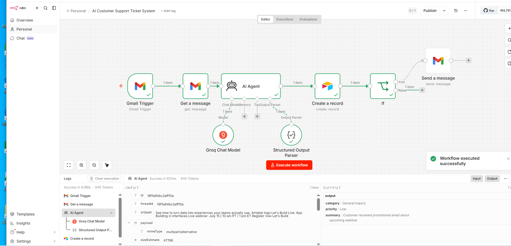

# AI Customer Support Ticket Automation

## Overview

The AI Customer Support Ticket Automation is an n8n workflow that automatically processes incoming customer support emails using an AI Agent powered by Groq. The workflow classifies each support request, assigns a priority level, creates a support ticket in Airtable, and sends automated email notifications to improve customer service operations.

---

## Business Problem

Customer support teams often receive a high volume of emails every day. Manually reading, categorizing, prioritizing, and tracking support requests is time-consuming and can lead to delayed responses, inconsistent ticket management, and reduced customer satisfaction.

---

## Solution

This workflow automatically:

- Monitors incoming Gmail messages.
- Retrieves the email content.
- Uses an AI Agent with Groq to classify support requests.
- Assigns a priority level.
- Creates a support ticket in Airtable.
- Sends automated email notifications.

---

## Workflow Overview

The screenshot below shows the actual n8n workflow built for this project.



---

## Technologies Used

- n8n
- Gmail Trigger
- Gmail
- AI Agent
- Groq Chat Model
- Structured Output Parser
- Tool Output Parser
- Airtable

---

## Workflow

```text
Gmail Trigger
      │
      ▼
Get Message
      │
      ▼
AI Agent
      │
      ▼
Airtable
      │
      ▼
IF
      │
      ▼
Gmail
```

---

## Business Value

- AI-powered ticket classification
- Automated priority assignment
- Faster customer response
- Improved support tracking
- Reduced manual workload

---

## Key Features

- AI ticket analysis
- Priority classification
- Airtable ticket creation
- Automated email notifications
- End-to-end support automation

---

## Future Improvements

- SLA monitoring
- Multi-language support
- Sentiment analysis
- Microsoft Teams integration
- Analytics dashboard

---

## Author

**Samuel Favour**

AI Automation Specialist

GitHub: https://github.com/SamFavour-Lab
